# Before the lab

## Download and Install QGIS
QGIS is an open source GIS application. If you already QGIS installed in your computer please update it to the latest version or latest stable release. If you don't have QGIS installed you can download it here: [Download QGIS](https://www.qgis.org/en/site/forusers/download.html)

- If it is your first time using QGIS, here's an [introduction tutorial](https://courses.spatialthoughts.com/introduction-to-qgis.html) to get familiar with the interface.
- Given that we will be working with PyQGIS, here's a [series of tutorials](https://anitagraser.com/pyqgis-101-introduction-to-qgis-python-programming-for-non-programmers/) to follow. Tutorials recommended for this exercise are number 6, 7, & 14. 

## Register at NASA Earthdata 
We will work with raster files, specifically a digital elevation model (DEM). The images will be obtained through Alaska Satelite Facility ASF, it contains imagery from various sensors. In our case we want the data from the Alos Palsar sensor. 

In order to download data, you must create a Nasa Earthdata Account here: [Nasa Earthdata Registration](https://urs.earthdata.nasa.gov/users/new?client_id=BO_n7nTIlMljdvU6kRRB3g&redirect_uri=https%3A%2F%2Fauth.asf.alaska.edu%2Flogin&response_type=code&state=https%3A%2F%2Fsearch.asf.alaska.edu)

# 1. Problem Statement
An Indiana Farm Association wants to assess the risk of flooded crops during rain season for each of their farms.  To evaluate this several relief and soil drainage properties have to be taken into account.  To reduce costs regarding in-site measurements, remote sensing will be used to calculate relief parameters. One of these parameters is the slope of the terrain, that will be calculated using digital elevation models and GIS Software.

To obtain the slope of every farm the association wants an automated tool for this purpose, also it is necessary to adjust the slope layer symbology to obtain slope map with a classified legend.

**In this lab you will create a QGIS tool using PyQGIS that will take a Digital Elevation Model, clip it to the extent of the farm and calculate the slope of the terrain.**

# 2. Data Acquisition

## Adding Basemap and creating polygon of interest
QGIS has different methods to add a basemap, one of them is connecting to a Web Map Service (WMS) URL. USGS has a catalog for this purpose. 

- Open the [catalog](https://www.sciencebase.gov/catalog/item/51509712e4b08df5cb1399f7) and select the 'Imagery Topo Base Map Service', and scroll down to find the WMS URL. 
- Copy the URL, then on QGIS, on the *Browser* window search for *WMS/WMTS*, right click and select the option *New connection*. 
- Add the name of the connection, paste the URL and hit OK.
- Once this is done, a new option with the connection name will appear under *WMS/WMTS* on the *Browser* window. Click on the conection and drag the layers to the main console in order to visualize it. 

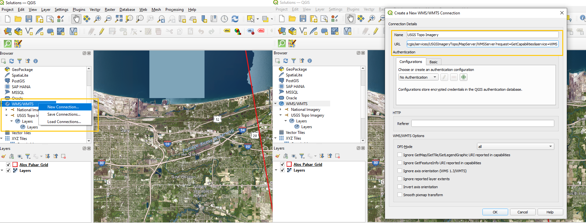

To create a polygon that represents the area of interest, a new shapefile layer needs to be created. 
- On the toolbar select *New Shapefile Layer...*, define the name and destination of the layer, then select 'Polygon' as the *Geometry Type*, and ESPG:4326-WGS 84 as the coordinate reference system. 

- Select the created layer on the *Layers* window, then on the toolbar look for a pencil icon named *Toggle Editing* and click it. This activates the editor mode on QGIS allowing to make changes to the layers. 
- Next to *Toggle Editing*, selec the option *Add Polygon Feature* and draw a polygon. To close the polygon right click and add the value of 1 to the id window that appears after finishing it. Then save the changes made and deactivate the editing mode.

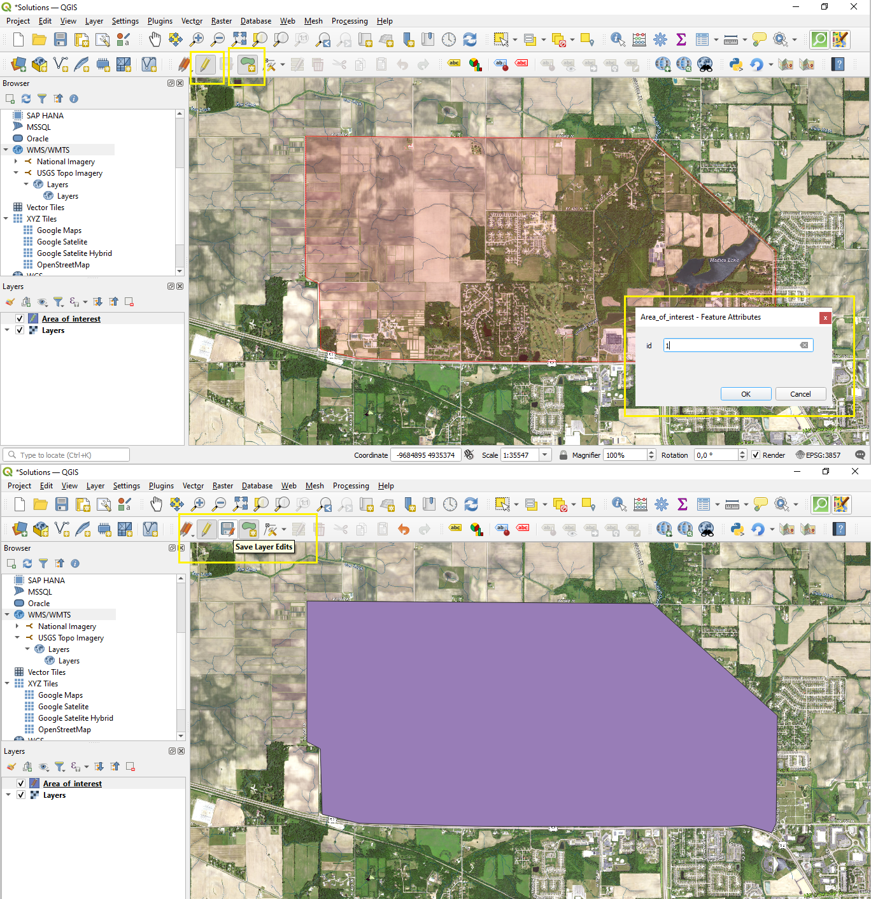

## Download Alos Palsar DEM from QGIS
Files under the name  'Alos_Palsar_Grid' will be used. The grid represents the different areas captured by the sensor inside the state of Indiana. 
Alos Palsar sensor follows linear paths. To ensure coverage images have overlapping zones, this means that sensor data from a intersection zone is present in more than one raster file. 

- On the upper menu bar, select *Layer* --> *Add Layer* --> *Add Vector Layer*, on *Source* click the three dots *...* and browse for the shapefile 'Alos_Palsar_Grid'**.shp**
- If the 'Alos_Palsar_Grid' layer does not intersect with the polygon created, it is because means the grid layer is on a different coordinate reference system. Right click on the grid layer, and select *Layer CRS*--> *Set to EPSG:4326*
- Select *Open the layer styling* on the *Layers* window, then select *Simple Lines* as the symbol layer type, with color red and a stroke width of 1 milimeter. Now on the created polygon, the basemap and the different grids for Alos Palsar imagery are visible. 
- Right click on the layer and select *Open attribute table*, on the table there is a column named 'URL', this is the URL used to download the sensor data for that specific cuadrant.

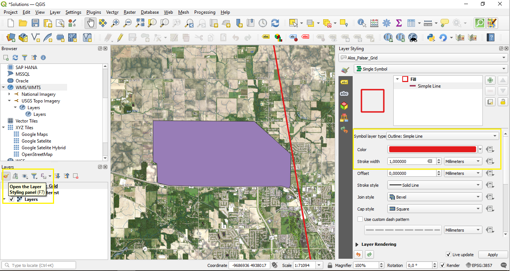

To open that URL directly from QGIS, an action for the 'Alos_Palsar_Grid' will be created. 

- Right click on the grid layer, open *Properties* --> *Actions*.
- Select *Create Default Actions*, and delete all the created actions except one called 'Open URL'.
- Select 'Open URL' action and replace the value in the *Action Text*, and hit OK
        [% "URL" %]

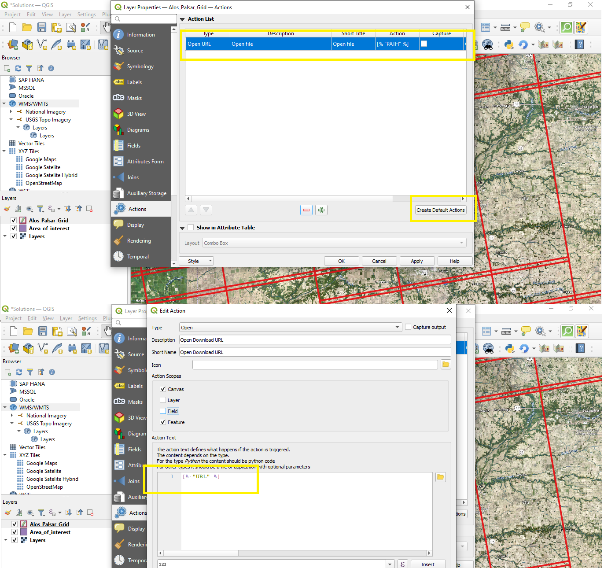

- On the toolbar click on the gear icon, an option called 'Open Download URL' will appear. Select it, then hit click where the area of interest is and a URL will be opened in the local browser to downloaded a zip file that contains the sensor data, including a DEM. Once it is download unzip the files, and select the file with the sufix '.dem'.

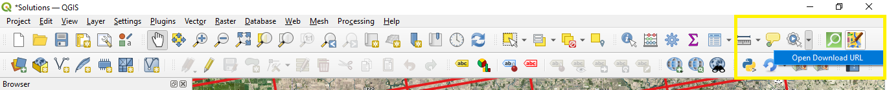

# 3. QGIS Processing
QGIS Python API otherwise known as PyQGIS allows programmers to create new tools, plugins, and processing scripts within the software interface. 

PyQGIS has 4 libraries:
- core: contains all basic GIS functionality
- gui: provides reusable GUI widgets
- analysis: provides high level tools for carrying out spatial analysis on vector and raster data, additonally it allows to create network topologies. 
- server: adds map server components to QGIS. 
- 3d: supports display of 3d data.

Within these libraries there are multiple Python classes that are built to execute all QGIS functionalities. All classes must be named with the prefix 'Qgs'.

## Processing Script
QGIS comes with established methods that are found in the Toolbox window. It is possible to create new tools to be part of this toolbox by writing a processing script. The script uses the Python console inside the *Toolbox* window and the PyQGIS classes. Processing scripts can use the already existent tools to create new workflows and spatial operations . 

In order to make things easier and structured, QGIS allows to create processing scripts following a template. On the *Toolbox* window click on the Python icon and select *Create New Script from Template*.

The goal is to build a processing script that will:
- Clip the previously downloaded DEM file to the extent of the area of interest.
- Fill the pixels that have no data using interpolation.
- Calculate the slope of the terrain.
- Adjust the symbology in order to display the results in a more comprehensible way. 

### Script structure
Let's disect the structure of the 'clip_dem' script

First the class 'QCoreApplication', is imported from the Qt framework. This class is used to provide and contain a main event loop, in which other events from the operating system and QGIS can be processed and dispatched.  Next qgis classes that will be used are imported from the qgis core module. 

        from qgis.PyQt.QtCore import QCoreApplication
        from qgis.core import (QgsProcessing,
                       QgsProcessingAlgorithm,
                       QgsProcessingParameterFeatureSource,
                       QgsProcessingParameterRasterLayer,
                       QgsProcessingParameterRasterDestination)
        from qgis import processing

A Python class is created, it contains all the parameters and methods needed in the processing algorithm. This class is named according to the purpose of the algorithm.  

        class ClipDemProcessingAlgorithm(QgsProcessingAlgorithm):

Given that the process algorithm works like a QGIS tool, parameters must be named. In this case the parameters are: a shapefile, a DEM file (input), and a clipped DEM (output) according to the extent of the shapefile.

        class ClipDemProcessingAlgorithm(QgsProcessingAlgorithm):
            DEM = 'dem'
            FARM_SHP = 'farm_shape'
            CLIP_DEM = 'clipped_dem'

Once the parameters are named, functions are used to provide a title and a short description of the algorithm.
            
            def tr(self, string):
                return QCoreApplication.translate('Processing', string)

            def createInstance(self):
                return ClipDemProcessingAlgorithm()

            def name(self):
                return 'clip_dem'

            def displayName(self):
                return self.tr('Clip Dem')

            def shortHelpString(self):
                return self.tr("Clip Raster by Mask Layer")

Next, the function that iniates the algorithm defines in further details the parameters. This is done by using the *QgsProcessingParameter* classes. In this case we define the input vector layer as a feature source, input DEM as a raster layer, and the output clipped DEM as a raster destination.

        def initAlgorithm(self, config=None):
            self.addParameter(
                QgsProcessingParameterFeatureSource(
                    self.FARM_SHP,
                    self.tr('Input Farm Shape'),
                    [QgsProcessing.TypeVectorAnyGeometry]
                )
            )
            self.addParameter(
                QgsProcessingParameterRasterLayer(
                    self.DEM,
                    self.tr('Input Raster DEM')
                    [QgsProcessing.TypeRaster]
                )
            )
        
            self.addParameter(
                QgsProcessingParameterRasterDestination(
                    self.CLIP_DEM,
                    self.tr('Output Clipped DEM')
                    [QgsProcessing.TypeRaster]
                )
            )

The previous code results in a tool with a QGIS graphic user interface.

The final function calls the current instance of the class to access the variables to be used in the algorithm. 

        def processAlgorithm(self, parameters, context, feedback):
            
                farm_shape= self.parameterAsSource(
                    parameters,
                    self.FARM_SHP,
                    context
                )
                dem = self.parameterAsRasterLayer(
                    parameters,
                    self.DEM,
                    context
                )

To execute the desired operation, an existent tool from QGIS is used. The tool is named *Clip Raster by Mask Layer*, it is executed using the *run()* method and it has its own requirements. 

There are two ways to know the tool requirements:
- Use the algortihm help method in the Python console.

        processing.algorithmHelp("native:buffer")

- Select and execute the tool from the *Toolbox* window, and then select on the top menu bar *Processing* --> *History* to see the requirements.

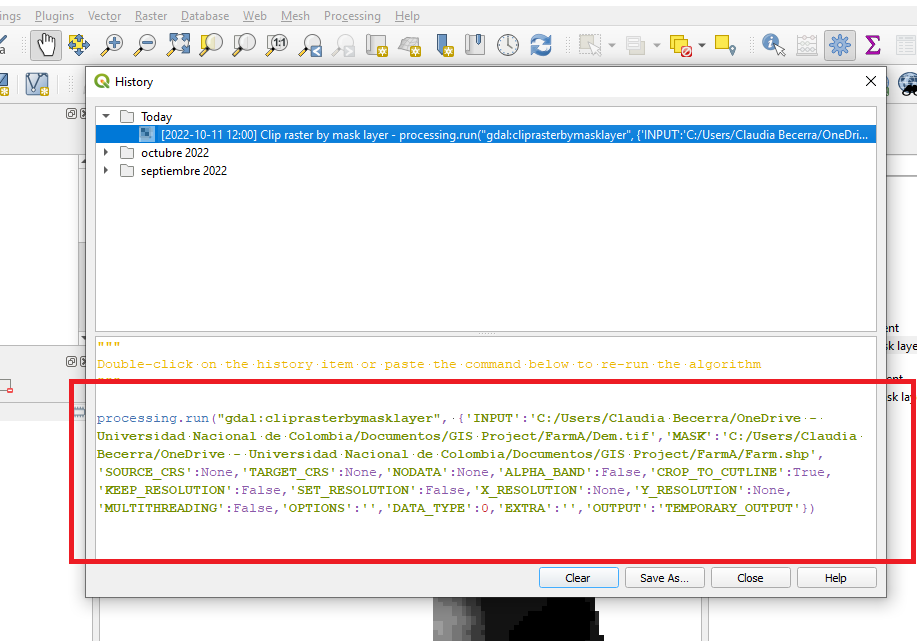

It is necessary to assign a variable name to the process in order to connect the results once the other operations are added. Once it is complete, the 'clipped_dem' parameter is returned to be equal as the ouput of the clipping operation. 

        clipping = processing.run(
                    'gdal:cliprasterbymasklayer',
                    {
                        'INPUT':parameters['dem'],
                        'MASK':parameters['farm_shape'],
                        'SOURCE_CRS':None,
                        'TARGET_CRS':None,
                        'TARGET_EXTENT':None,
                        'NODATA':-9999,
                        'ALPHA_BAND':False,
                        'CROP_TO_CUTLINE':True,
                        'KEEP_RESOLUTION':False,
                        'SET_RESOLUTION':False,
                        'X_RESOLUTION':None,
                        'Y_RESOLUTION':None,
                        'MULTITHREADING':False,
                        'OPTIONS':'',
                        'DATA_TYPE':0,
                        'EXTRA':'',
                        'OUTPUT':parameters['clipped_dem']
                    }
                )

        return {'clipped_dem': clipping['OUTPUT']}

### Putting it together
To integrate the other processes, the addtional parameters and operations must be created under the *def processAlgorithm* function. The result from the previous operation becomes the input of the next one. You will write the code for the remaining steps: filling the gaps using 'gdal:fillnodata' and calculating the slope with  'native:slope'.

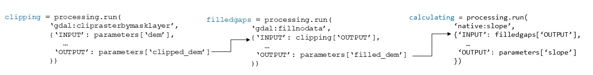

Last step is returning the results.

        return {'clipped_dem': clipping['OUTPUT']}
        return {'filled_dem': filledgaps['OUTPUT']}
        return {'slope': calculate['OUTPUT']}  

Once we hit 'Save', QGIS will authomatically open the processing folder. If the script is saved in a different location it will not appear on the *Toolbox* window to be executed. Path to processing folder:

        'C:\User Folder\AppData\Roaming\QGIS\QGIS3\profiles\default\processing\scripts'

The script must be named according to the information stated when the class for the algorithm was created. Taking the 'clip_dem' as an example:

        def name(self):
                return 'clip_dem'

Now that the processing script was saved correctly, it can be executed. By selecting the area of interest and DEM file as input parameters, and defining the destination of the outputs, three different layers are obtained: a clipped DEM, a filled DEM without data gaps, and a raster file that represents the slope in degrees of the terrain.

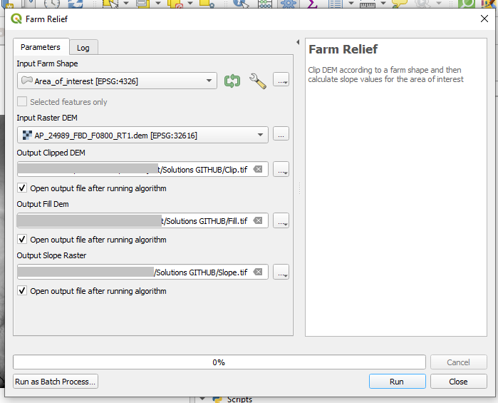

# 4. Data Visualization 
The results are visually represented in a single band of grey tones. This symbology is not very helpful for understanding spatial data, therefore, the code named 'Symbology.py' will be executed from the Python console. 
It is executed from the console instead of the *Toolbox* window, because we need to interact with the QGIS interface.

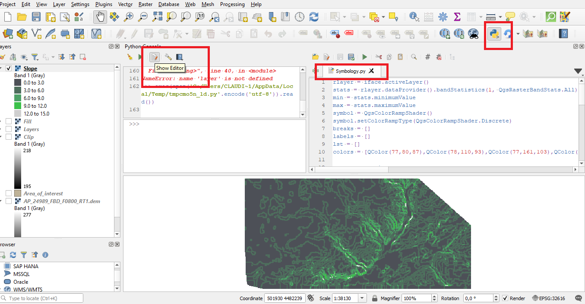

To interact with the interface, PyQGIS uses the 'iface' class.
The code classifies slope values in 5 equal intervals, assigns a color to each interval, and adds a new legend that shows the limit values of the interval. This helps to visualize steep or plain zones better. The 'slope' layer must be selected so that the code from 'Symbology.py' identifies it as the active layer to be reclassified.

Create a layout view of your map by clicking on the top menu bar *Project* --> *New Print Layout* and assing a name to the layout.

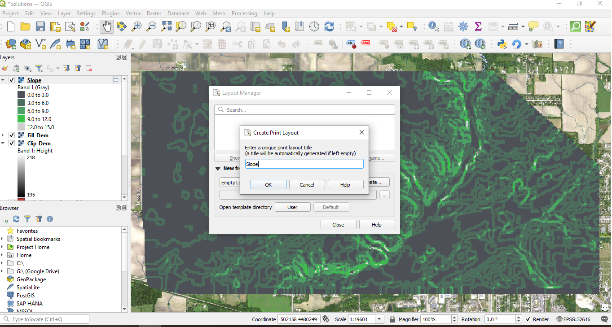

A new window will open, then on the left menu bar select *Add Map* to add the layers present in the QGIS project, then select *Add Label* and create a title for the map, and to add the legend select *Add Legend*, arrange how you want the pieces to be layed out. 

Export final product clicking on *Layout* and select *Export as Image*. 

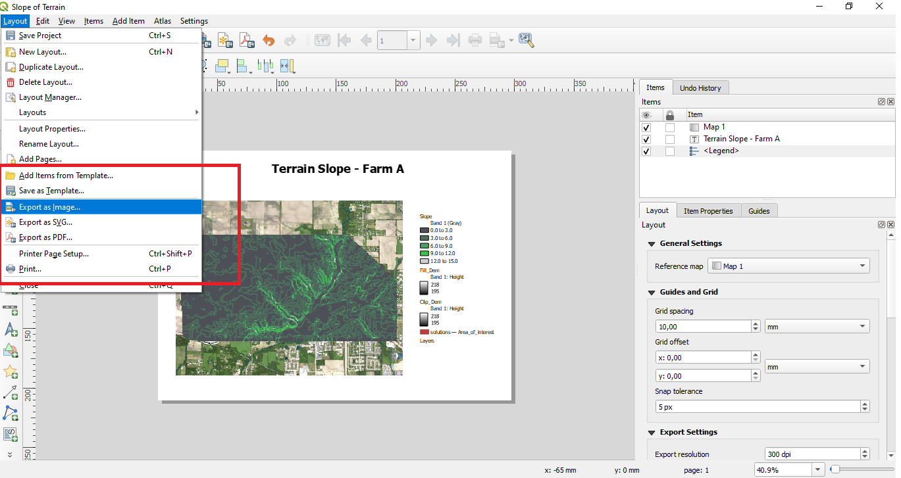

Final results should be similar to this:

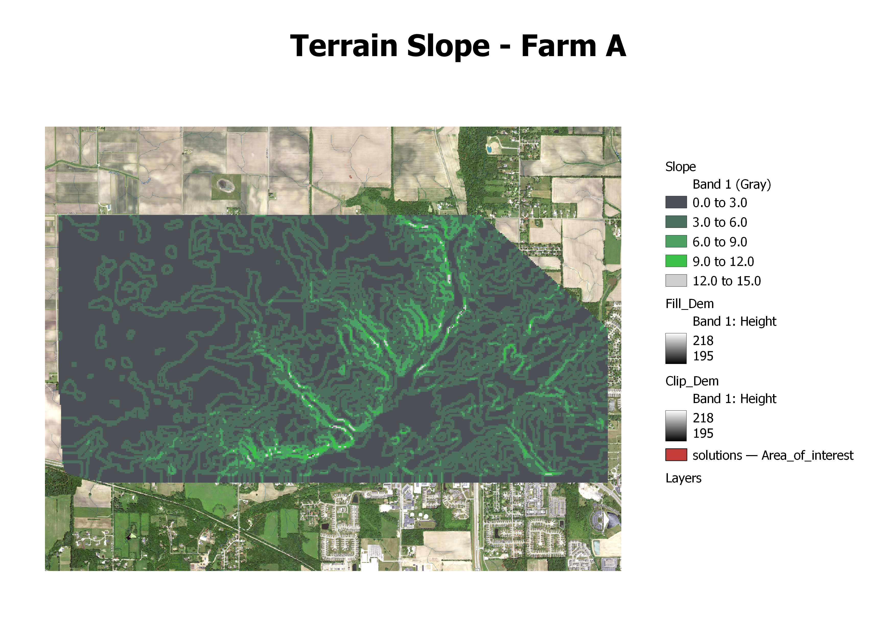

