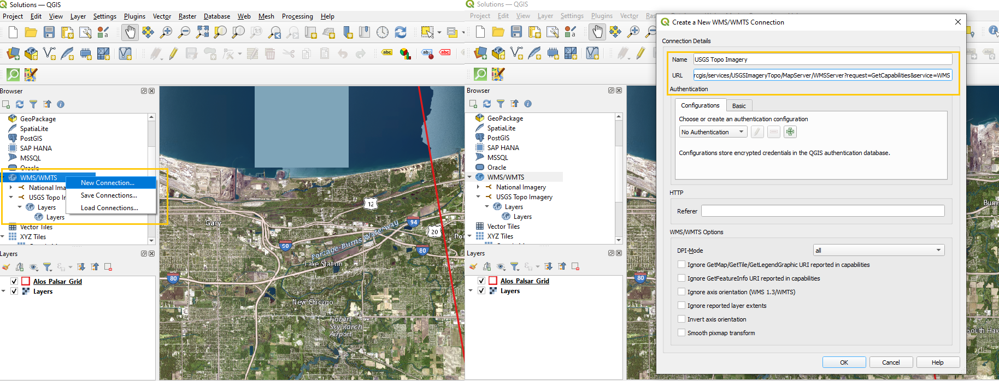
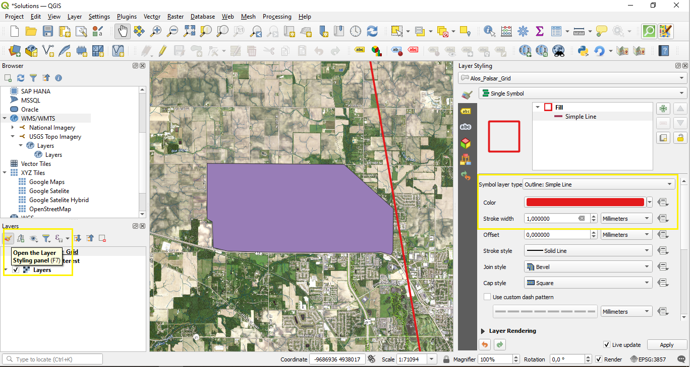
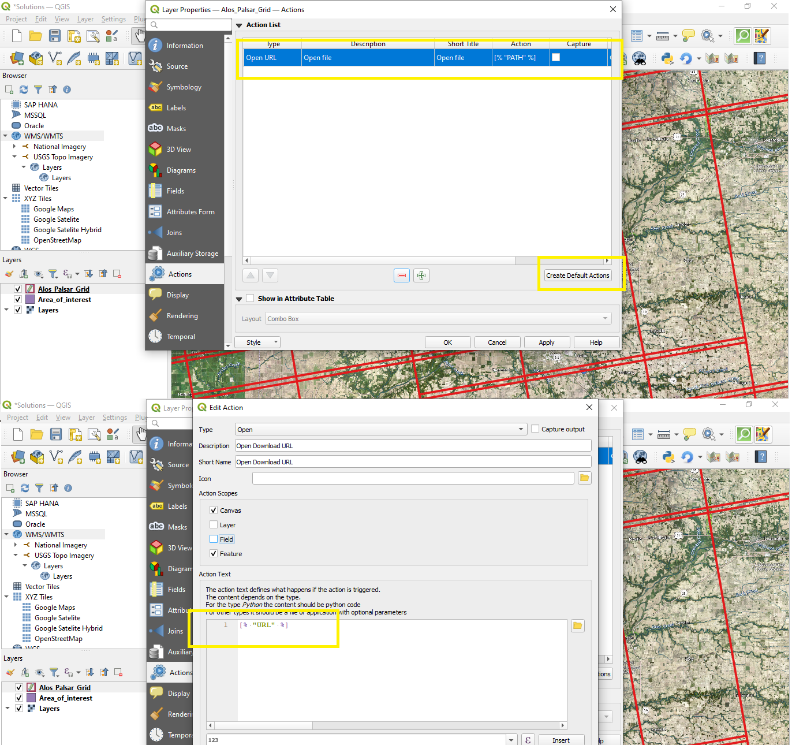
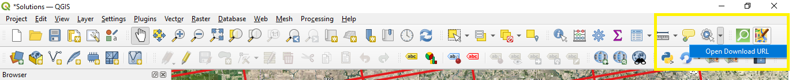

# Download DEM

## Adding Basemap and creating polygon of interest
QGIS has different methods to add a basemap, one of them is connecting to a Web Map Service (WMS) URL. USGS has a catalog for this purpose. 

- Open the [catalog](https://www.sciencebase.gov/catalog/item/51509712e4b08df5cb1399f7) and select the 'Imagery Topo Base Map Service', and scroll down to find the WMS URL. 
- Copy the URL, then on QGIS, on the *Browser* window search for *WMS/WMTS*, right click and select the option *New connection*. 
- Add the name of the connection, paste the URL and hit OK.
- Once this is done, a new option with the connection name will appear under *WMS/WMTS* on the *Browser* window. Click on the conection and drag the layers to the main console in order to visualize it. 

To create a polygon that represents the area of interest, a new shapefile layer needs to be created. 
- On the toolbar select *New Shapefile Layer...*, define the name and destination of the layer, then select 'Polygon' as the *Geometry Type*, and ESPG:4326-WGS 84 as the coordinate reference system. 

- Select the created layer on the *Layers* window, then on the toolbar look for a pencil icon named *Toggle Editing* and click it. This activates the editor mode on QGIS allowing to make changes to the layers. 
- Next to *Toggle Editing*, selec the option *Add Polygon Feature* and draw a polygon. To close the polygon right click and add the value of 1 to the id window that appears after finishing it. Then save the changes made and deactivate the editing mode.

## Download Alos Palsar DEM from QGIS
Files under the name  'Alos_Palsar_Grid' will be used. The grid represents the different areas captured by the sensor inside the state of Indiana. 
Alos Palsar sensor follows linear paths. To ensure coverage images have overlapping zones, this means that sensor data from a intersection zone is present in more than one raster file. 

- On the upper menu bar, select *Layer* --> *Add Layer* --> *Add Vector Layer*, on *Source* click the three dots *...* and browse for the shapefile 'Alos_Palsar_Grid'**.shp**
- If the 'Alos_Palsar_Grid' layer does not intersect with the polygon created, it is because means the grid layer is on a different coordinate reference system. Right click on the grid layer, and select *Layer CRS*--> *Set to EPSG:4326*
- Select *Open the layer styling* on the *Layers* window, then select *Simple Lines* as the symbol layer type, with color red and a stroke width of 1 milimeter. Now on the created polygon, the basemap and the different grids for Alos Palsar imagery are visible. 
- Right click on the layer and select *Open attribute table*, on the table there is a column named 'URL', this is the URL used to download the sensor data for that specific cuadrant.

To open that URL directly from QGIS, an action for the 'Alos_Palsar_Grid' will be created. 

- Right click on the grid layer, open *Properties* --> *Actions*.
- Select *Create Default Actions*, and delete all the created actions except one called 'Open URL'.
- Select 'Open URL' action and replace the value in the *Action Text*, and hit OK
        [% "URL" %]

- On the toolbar click on the gear icon, an option called 'Open Download URL' will appear. Select it, then hit click where the area of interest is and a URL will be opened in the local browser to downloaded a zip file that contains the sensor data, including a DEM. Once it is download unzip the files, and select the file with the sufix '.dem'.

