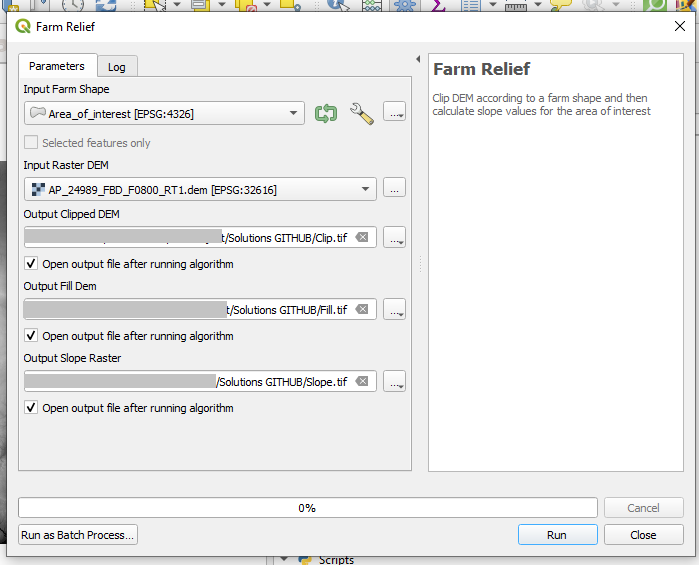

# QGIS Processing
QGIS Python API otherwise known as PyQGIS allows programmers to create new tools, plugins, and processing scripts within the software interface. 

PyQGIS has 4 libraries:
- core: contains all basic GIS functionality
- gui: provides reusable GUI widgets
- analysis: provides high level tools for carrying out spatial analysis on vector and raster data, additonally it allows to create network topologies. 
- server: adds map server components to QGIS. 
- 3d: supports display of 3d data.

Within these libraries there are multiple Python classes that are built to execute all QGIS functionalities. All classes must be named with the prefix 'Qgs'.

## Processing Script
QGIS comes with established methods that are found in the Toolbox window. It is possible to create new tools to be part of this toolbox by writing a processing script. The script uses the Python console inside the *Toolbox* window and the PyQGIS classes. Processing scripts can use the already existent tools to create new workflows and spatial operations . 

In order to make things easier and structured, QGIS allows to create processing scripts following a template. On the *Toolbox* window click on the Python icon and select *Create New Script from Template*.

The goal is to build a processing script that will:
- Clip the previously downloaded DEM file to the extent of the area of interest.
- Fill the pixels that have no data using interpolation.
- Calculate the slope of the terrain.
- Adjust the symbology in order to display the results in a more comprehensible way.

This repository contains a separate code for each step (clipping, filling, & calculating), and one consolidated script that joins the three together. 

### Script structure
Let's disect the structure of the 'clip_dem' script

First the class 'QCoreApplication', is imported from the Qt framework. This class is used to provide and contain a main event loop, in which other events from the operating system and QGIS can be processed and dispatched.  Next qgis classes that will be used are imported from the qgis core module. 

        from qgis.PyQt.QtCore import QCoreApplication
        from qgis.core import (QgsProcessing,
                       QgsProcessingAlgorithm,
                       QgsProcessingParameterFeatureSource,
                       QgsProcessingParameterRasterLayer,
                       QgsProcessingParameterRasterDestination)
        from qgis import processing

A Python class is created, it contains all the parameters and methods needed in the processing algorithm. This class is named according to the purpose of the algorithm.  

        class ClipDemProcessingAlgorithm(QgsProcessingAlgorithm):

Given that the process algorithm works like a QGIS tool, parameters must be named. In this case the parameters are: a shapefile, a DEM file (input), and a clipped DEM (output) according to the extent of the shapefile.

        class ClipDemProcessingAlgorithm(QgsProcessingAlgorithm):
            DEM = 'dem'
            FARM_SHP = 'farm_shape'
            CLIP_DEM = 'clipped_dem'

Once the parameters are named, functions are used to provide a title and a short description of the algorithm.
            
            def tr(self, string):
                return QCoreApplication.translate('Processing', string)

            def createInstance(self):
                return ClipDemProcessingAlgorithm()

            def name(self):
                return 'clip_dem'

            def displayName(self):
                return self.tr('Clip Dem')

            def shortHelpString(self):
                return self.tr("Clip Raster by Mask Layer")

Next, the function that iniates the algorithm defines in further details the parameters. This is done by using the *QgsProcessingParameter* classes. In this case we define the input vector layer as a feature source, input DEM as a raster layer, and the output clipped DEM as a raster destination.

        def initAlgorithm(self, config=None):
            self.addParameter(
                QgsProcessingParameterFeatureSource(
                    self.FARM_SHP,
                    self.tr('Input Farm Shape'),
                    [QgsProcessing.TypeVectorAnyGeometry]
                )
            )
            self.addParameter(
                QgsProcessingParameterRasterLayer(
                    self.DEM,
                    self.tr('Input Raster DEM')
                    [QgsProcessing.TypeRaster]
                )
            )
        
            self.addParameter(
                QgsProcessingParameterRasterDestination(
                    self.CLIP_DEM,
                    self.tr('Output Clipped DEM')
                    [QgsProcessing.TypeRaster]
                )
            )

The previous code results in a tool with a QGIS graphic user interface.

The final function calls the current instance of the class to access the variables to be used in the algorithm. 

        def processAlgorithm(self, parameters, context, feedback):
            
                farm_shape= self.parameterAsSource(
                    parameters,
                    self.FARM_SHP,
                    context
                )
                dem = self.parameterAsRasterLayer(
                    parameters,
                    self.DEM,
                    context
                )

To execute the desired operation, an existent tool from QGIS is used. The tool is named *Clip Raster by Mask Layer*, it is executed using the *run()* method and it has its own requirements. 

There are two ways to know the tool requirements:
- Use the algortihm help method in the Python console.

        processing.algorithmHelp("native:buffer")

- Select and execute the tool from the *Toolbox* window, and then select on the top menu bar *Processing* --> *History* to see the requirements.

It is necessary to assign a variable name to the process in order to connect the results once the other operations are added. Once it is complete, the 'clipped_dem' parameter is returned to be equal as the ouput of the clipping operation. 

        clipping = processing.run(
                    'gdal:cliprasterbymasklayer',
                    {
                        'INPUT':parameters['dem'],
                        'MASK':parameters['farm_shape'],
                        'SOURCE_CRS':None,
                        'TARGET_CRS':None,
                        'TARGET_EXTENT':None,
                        'NODATA':-9999,
                        'ALPHA_BAND':False,
                        'CROP_TO_CUTLINE':True,
                        'KEEP_RESOLUTION':False,
                        'SET_RESOLUTION':False,
                        'X_RESOLUTION':None,
                        'Y_RESOLUTION':None,
                        'MULTITHREADING':False,
                        'OPTIONS':'',
                        'DATA_TYPE':0,
                        'EXTRA':'',
                        'OUTPUT':parameters['clipped_dem']
                    }
                )

        return {'clipped_dem': clipping['OUTPUT']}

### Putting it together
To integrate the other processes, the addtional parameters and operations must be created under the *def processAlgorithm* function. The result from the previous operation becomes the input of the next one.

Last step is returning the results.

        return {'clipped_dem': clipping['OUTPUT']}
        return {'filled_dem': filledgaps['OUTPUT']}
        return {'slope': calculate['OUTPUT']}  

Once we hit 'Save', QGIS will authomatically open the processing folder. If the script is saved in a different location it will not appear on the *Toolbox* window to be executed. Path to processing folder:

        'C:\User Folder\AppData\Roaming\QGIS\QGIS3\profiles\default\processing\scripts'

The script must be named according to the information stated when the class for the algorithm was created. Taking the 'clip_dem' as an example:

        def name(self):
                return 'clip_dem'

Now that the processing script was saved correctly, it can be executed. By selecting the area of interest and DEM file as input parameters, and defining the destination of the outputs, three different layers are obtained: a clipped DEM, a filled DEM without data gaps, and a raster file that represents the slope in degrees of the terrain.

### Symbology
The results are visually represented in a single band of grey tones. This symbology is not very helpful for understanding spatial data, therefore, the code named 'Symbology.py' will be executed from the Python console. 
It is executed from the console instead of the *Toolbox* window, because we need to interact with the QGIS interface.

To interact with the interface, PyQGIS uses the 'iface' class.
The code classifies slope values in 5 equal intervals, assigns a color to each interval, and adds a new legend that shows the limit values of the interval. This helps to visualize steep or plain zones better. The 'slope' layer must be selected so that the code from 'Symbology.py' identifies it as the active layer to be reclassified.

Final results should be similar to this:

Example results are saved in a geopackage inside the 'Solutions' folder. 